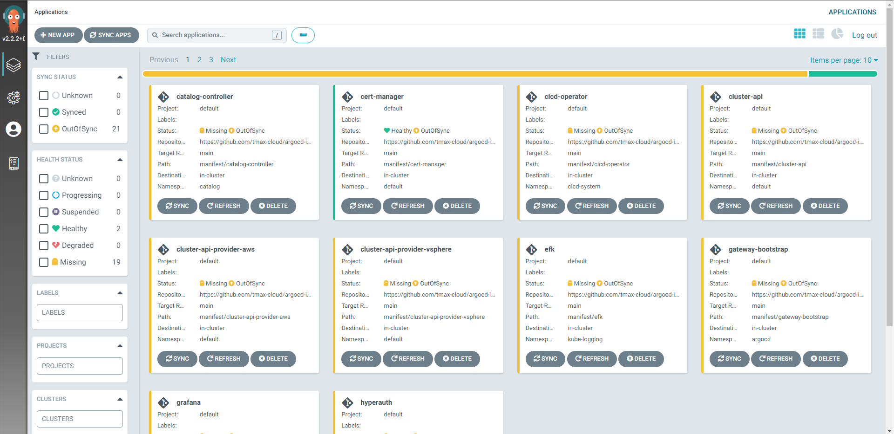
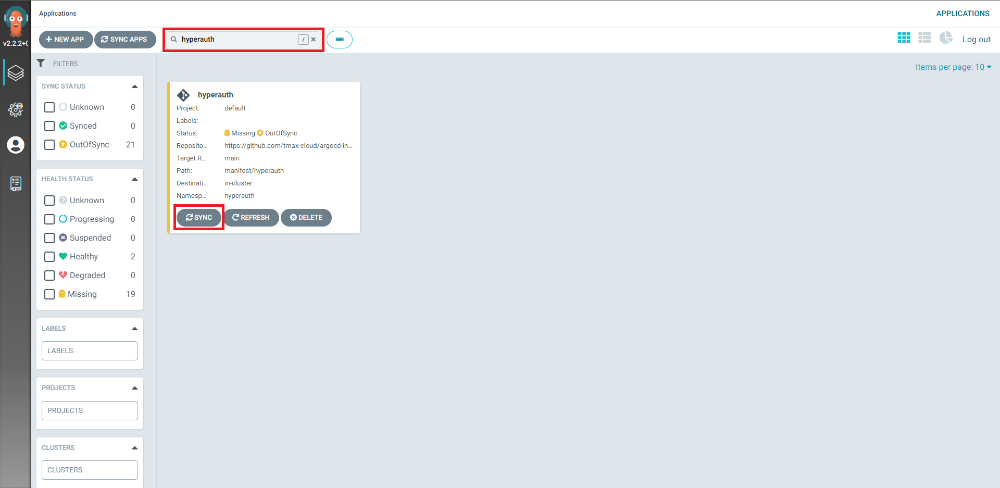
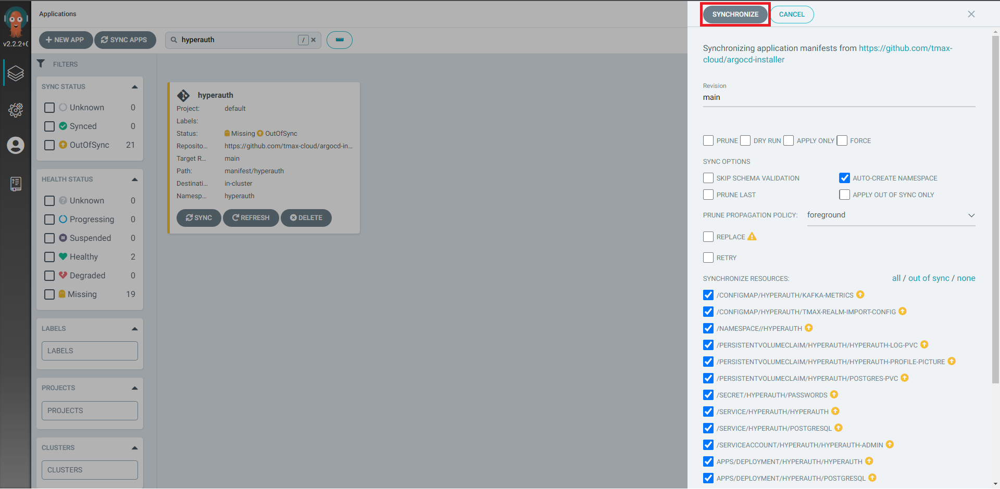
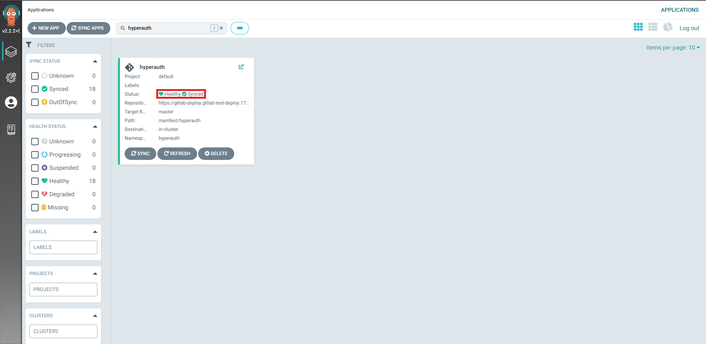

# Installation Guide for Master Cluster
## Prerequisites
    1. ArgoCD([Install guide link](https://github.com/tmax-cloud/install-argocd))
---
## How to install
1. cluster configuration
    - cluster에 필요한 정보(registry domain, hypercloud domain등)를 셋팅한다.
    - 수정해야 하는 파일은 아래와 같다.
        ```
        $ application/helm/shared-values.yaml
        $ application/helm/master-values.yaml
        ```
    - git에 push한다.
---
2. application 변수 셋팅
    - application/app_of_apps/master-applications.yaml file을 수정한다.
    - 설치 환경에서 바라볼 git repo url, branch를 설정
        ```
        spec:
          ...
          source:
            ...
            repoURL: {{ git_repo_url }}
            targetRevision: {{ target_branch_or_release }}
    - gitlab의 경우 git repo url 마지막에 .git을 추가해주어야함  
    ex) repoURL: https://gitlab.com/root/argocd-installer.git
---
3. application 등록
    - 설치 환경에 application을 등록
        ```
        $ kubectl -n argocd apply -f application/app_of_apps/master-applications.yaml
        ```
---
4. resource 배포(application sync)
    - application sync 순서는 INSTALL_ORDER.md([링크](INSTALL_ORDER.md))를 참조
    - 순서에 맞춰서 모듈을 sync
    - sync 방식은 아래와 같음
    1) argocd server에 접속후 로그인
        - argocd server 주소는 다음과 같이 알 수 있음
            ```
            $ kubectl get svc -n argocd argocd-server
            ```
            
    
    2) application sync
        - sync하고자 하는 application을 찾아서 sync 버튼을 클릭  
        

        - option 및 sync target을 설정하고 synchronize 버튼 클릭
        

    3) sync status 확인
        - sync status(health check, sync check)를 확인
        

        - app card를 누르면 리소스별 status 체크 가능
        